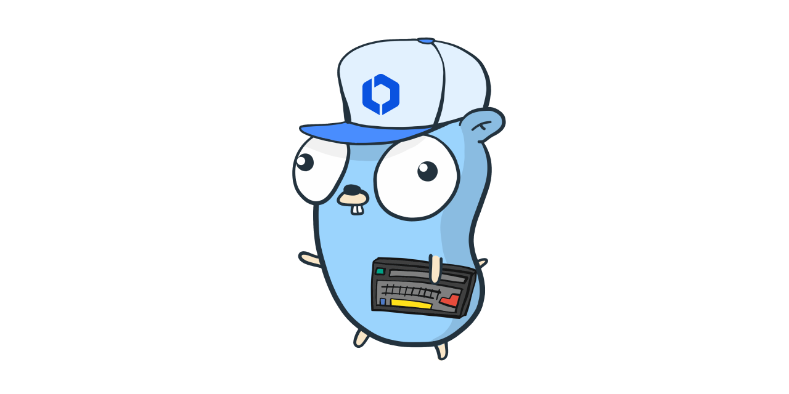

<p align="center">
    <a href="https://github.com/OpsLevel/opslevel-go/blob/main/LICENSE" alt="License">
        </a>
    <a href="http://golang.org" alt="Made With Go">
        </a>
    <a href="https://GitHub.com/OpsLevel/opslevel-go/releases/" alt="Release">
        </a>
    <a href="https://GitHub.com/OpsLevel/opslevel-go/issues/" alt="Issues">
        </a>
    <a href="https://github.com/OpsLevel/opslevel-go/graphs/contributors" alt="Contributors">
        </a>
    <a href="https://github.com/OpsLevel/opslevel-go/pulse" alt="Activity">
        </a>
	<a href="https://codecov.io/gh/OpsLevel/opslevel-go">
  		</a>
    <a href="https://dependabot.com/" alt="Dependabot">
        </a>
    <a href="https://pkg.go.dev/github.com/opslevel/opslevel-go/v2024" alt="Go Reference">
        </a>
</p>



[](https://app.opslevel.com/services/opslevel_api_clients/maturity-report)

# opslevel-go

Package `opslevel` provides an OpsLevel API client implementation.


# Installation

`opslevel` requires Go version 1.8 or later.

```bash
go get -u github.com/opslevel/opslevel-go
```

# Usage

Construct a client, specifying the [API token](https://app.opslevel.com/api_tokens). Then, you can use it to make GraphQL queries and mutations.

```Go
client := opslevel.NewGQLClient(opslevel.SetAPIToken("XXX_API_TOKEN_XXX"))
// Use client...
```

You can validate the client can successfully talk to the OpsLevel API.

```go
client := opslevel.NewClient("XXX_API_TOKEN_XXX")
if err := client.Validate(); err != nil {
	panic(err)
}
```

Every resource (IE: service, lifecycle, tier, etc) in OpsLevel API has a corresponding data structure in go as well as the graphql query & mutation inputs.  Additionally there is also some helper functions that use native go types like `string` and `[]string` to make it easier to work with.  The following are a handful of examples:

Find a service given an alias and print the owning team name:

```go
foundService, foundServiceErr := client.GetServiceWithAlias("MyCoolService")
if foundServiceErr != nil {
	panic(foundServiceErr)
}
fmt.Println(foundService.Owner.Name)
```

Create a new service in OpsLevel and print the ID:

```go
serviceCreateInput := opslevel.ServiceCreateInput{
	Name:        "MyCoolService",
	Product:     "MyProduct",
	Description: "The Coolest Service",
	Language:    "go",
}
newService, newServiceErr := client.CreateService(serviceCreateInput)
if newServiceErr != nil {
	panic(newServiceErr)
}
fmt.Println(newService.Id)
```

Assign the tag `{"hello": "world"}` to our newly created service and print all the tags currently on it:

```go
allTagsOnThisService, assignTagsErr := client.AssignTags(newService.Id, map[string]string{"hello": "world"})
if assignTagsErr != nil {
	panic(assignTagsErr)
}
for _, tagOnService := range allTagsOnThisService {
	fmt.Printf("Tag '{%s : %s}'", tagOnService.Id, tagOnService.Value)
}
```

List all the tags for a service:

```go
myService, foundServiceErr := client.GetServiceWithAlias("MyCoolService")
if foundServiceErr != nil {
	panic(foundServiceErr)
}
tags, getTagsErr := myService.GetTags(client, nil)
if getTagsErr != nil {
	panic(getTagsErr)
}
for _, tag := range tags {
	fmt.Printf("Tag '{%s : %s}'\n", tag.Key, tag.Value)
}
```

Build a lookup table of teams:

```go
func GetTeams(client *opslevel.Client) (map[string]opslevel.Team, error) {
	teams := make(map[string]opslevel.Team)
	data, dataErr := client.ListTeams()
	if dataErr != nil {
		return teams, dataErr
	}
	for _, team := range data {
		teams[string(team.Alias)] = team
	}
	return teams, nil
}
```

# Advanced Usage

The client also exposes functions `Query` and `Mutate` for doing custom query or mutations.  We are running ontop of this [go graphql library](https://github.com/hasura/go-graphql-client) so you can read up on how to define go structures that represent a query or mutation there but examples of each can be found [here](examples/).
